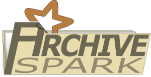
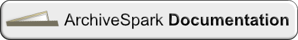
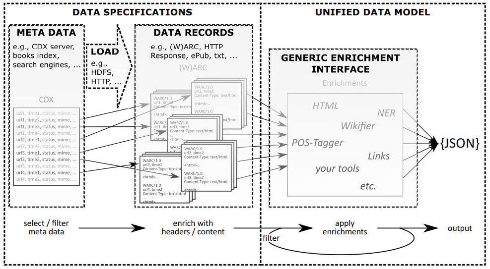

# ArchiveSpark

An Apache Spark framework for easy data processing, extraction as well as derivation for archival collections. Originally developed for the use with Web archives, it has now been extended to support any archival dataset through Data Specifications.

For more information and instructions, please [**read the docs**](docs/README.md):
 
 

## Approach

In the traditional Spark / Map Reduce approach datasets get loaded completely before irrelevant records are filtered out and relevant ones are transformed into something more valuable by extracting and deriving meaningful information.

In contrast to this, ArchiveSpark incorporates lightweight metadata records about the items in a dataset, which are commonly available for archival collections. Now, basic operations, like filtering, deduplication, grouping, sorting, will be performed on these metadata records, before they get enriched with additional information from the actual data records. Hence, rather than starting from everything and removing unnecessary data, ArchiveSpark starts from metadata that gets extended, leading to significant efficiency improvements in the work with archival collections.:

The original version of ArchiveSpark was developed for Web archives, with the metadata coming from CDX (crawl index) and the data being stored in (W)ARC files. With the later introduction of Data Specifications, ArchiveSpark can now be used with any archival collection that provides metadata records along with the data. For more details, please [read the docs](docs/README.md) and the publications below. 

## Read more / cite

ArchiveSpark has been published in a research paper at JCDL 2016, where it was nominated for the Best Paper Award. If you use ArchiveSpark in your work, please cite:

[H. Holzmann, V. Goel and A. Anand. *ArchiveSpark: Efficient Web Archive Access, Extraction and Derivation.* 16th ACM/IEEE-CS Joint Conference on Digital Libraries (JCDL). Newark, New Jersey, USA. June 2016.](http://dl.acm.org/citation.cfm?id=2910902) [**Get full-text PDF**](http://www.helgeholzmann.de/papers/JCDL_2016_ArchiveSpark.pdf)

The extensions to make it a more universal / generic data processing platform for any archival collection were presented by a short paper at IEEE BigData 2017:

[H. Holzmann, Emily Novak Gustainis and Vinay Goel. *Universal Distant Reading through Metadata Proxies with ArchiveSpark*. 5th IEEE International Conference on Big Data (BigData). Boston, MA, USA. December 2017.](http://cci.drexel.edu/bigdata/bigdata2017/AcceptedPapers.html) [**Get full-text PDF**](http://www.helgeholzmann.de/papers/BIGDATA_2017.pdf)

## Related projects

**[ArchiveSpark-server](https://github.com/helgeho/ArchiveSpark-server)**

A server application that provides a Web service API for ArchiveSpark to be used by third-party applications to integrate temporal Web archive data with a flexible, easy-to-use interface. 

**[ArchiveSpark2Triples](https://github.com/helgeho/ArchiveSpark2Triples)**

This library provides tools to convert ArchiveSpark records from Web archives to [RDF](https://en.wikipedia.org/wiki/Resource_Description_Framework) triples in [*Notation3 (N3)*](https://en.wikipedia.org/wiki/Notation3) format.

**[HadoopConcatGz](https://github.com/helgeho/HadoopConcatGz)**

A Splitable Hadoop InputFormat for Concatenated GZIP Files and *.(w)arc.gz, used by ArchiveSpark to load plain Web archive data (WARC) without a metadata index.

**[Web2Warc](https://github.com/helgeho/Web2Warc)**

If you do not have Web archive data available to be used with ArchiveSpark, easily create your own from any collection of websites with [Web2Warc](https://github.com/helgeho/Web2Warc).

**[ArchivePig](https://github.com/helgeho/ArchivePig)**

The original implementation of the ArchiveSpark concept was built on [Apache Pig](https://pig.apache.org) instead of Spark.
The project was the inspiration for this one and can be found under [ArchivePig](https://github.com/helgeho/ArchivePig).
However, it is not actively being developed anymore, but can be used if you prefer Pig over Spark.

## License

The MIT License (MIT)

Copyright (c) 2015-2018 [Helge Holzmann](http://www.HelgeHolzmann.de) ([L3S](http://www.L3S.de)) and Vinay Goel ([Internet Archive](http://www.archive.org))

Permission is hereby granted, free of charge, to any person obtaining a copy
of this software and associated documentation files (the "Software"), to deal
in the Software without restriction, including without limitation the rights
to use, copy, modify, merge, publish, distribute, sublicense, and/or sell
copies of the Software, and to permit persons to whom the Software is
furnished to do so, subject to the following conditions:

The above copyright notice and this permission notice shall be included in all
copies or substantial portions of the Software.

THE SOFTWARE IS PROVIDED "AS IS", WITHOUT WARRANTY OF ANY KIND, EXPRESS OR
IMPLIED, INCLUDING BUT NOT LIMITED TO THE WARRANTIES OF MERCHANTABILITY,
FITNESS FOR A PARTICULAR PURPOSE AND NONINFRINGEMENT. IN NO EVENT SHALL THE
AUTHORS OR COPYRIGHT HOLDERS BE LIABLE FOR ANY CLAIM, DAMAGES OR OTHER
LIABILITY, WHETHER IN AN ACTION OF CONTRACT, TORT OR OTHERWISE, ARISING FROM,
OUT OF OR IN CONNECTION WITH THE SOFTWARE OR THE USE OR OTHER DEALINGS IN THE
SOFTWARE.
