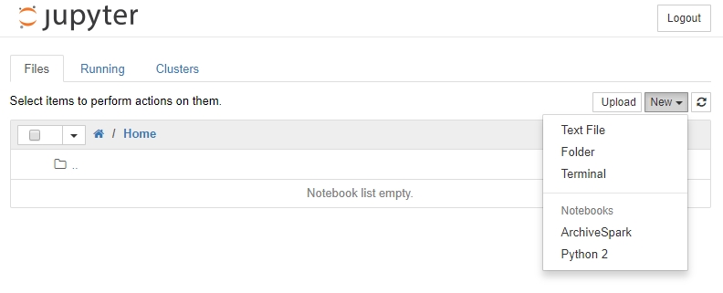
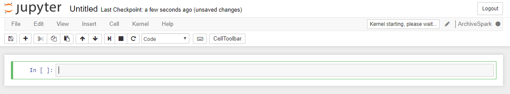
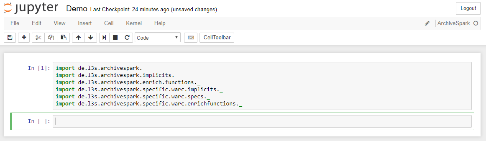
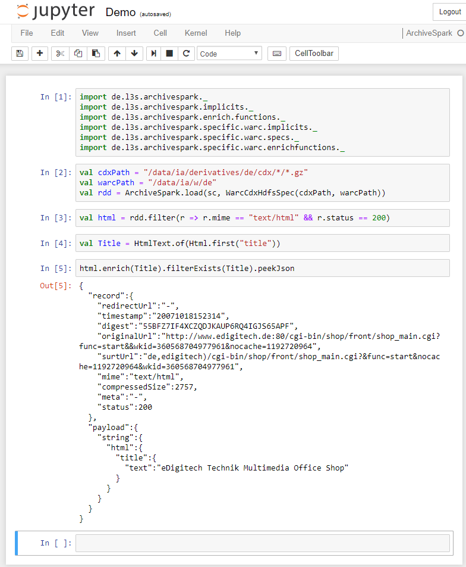
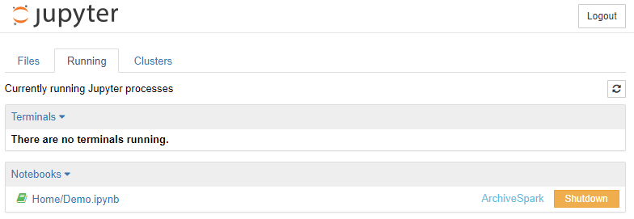

[< Table of Contents](README.md) | [General Usage >](General_Usage.md)
:---|---:

# Using ArchiveSpark with Jupyter

Please first install [Jupyter](http://jupyter.org) as described under [Install ArchiveSpark with Jupyter](Installing_Jupyter.md) or use our pre-packed Docker image (https://github.com/helgeho/ArchiveSpark-docker).

In order to start Jupyter, create a directory to store your Jupyter notebooks.  
From within this directory run:
```
jupyter notebook
```

Jupyter will show you the port that it is listening on for connections. You can open Jupyter in your browser under `http://HOST:PORT`. The host is the hostname or IP address of the server that you are running it on or `localhost` if you are running it on your local machine. If you would like to specify a port yourself or change other configurations, please find more information in the official Jupyter documentation: http://jupyter-notebook.readthedocs.io/en/stable/config.html

Once you open Jupyter in your browser, you should be presented with a screen like shown in the following screenshot. To create a new notebook and start ArchiveSpark, please click `New > ArchiveSpark`. In case `ArchiveSpark` is not shown here, please check [your setup](Installing_Jupyter.md).



An empty notebook should be opened that looks as follows:



You can change the name of the notebook at the top of the page(`Untitled`). Please wait until the `Kernel starting, please wait...` message disappears.

You are now ready to execute ArchiveSpark instructions. These can be entered in the cells of your Jupyter notebook and exectured by pressing `Shift+Enter`. In the very first cell commonly the required modules/packages of ArchiveSpark need to be imported:



By default, the required imports are the following. The first two are the general ArchiveSpark imports that are almost always needed. The last one is specific to web archive datasets and may not be required if you use ArchiveSpark with different kinds of collections. In that case, you might need different or additional imports to get access to different datasets or additional enrichment functions (the corresponding JAR files should be put into your libraries folder, s. [Install ArchiveSpark with Jupyter](Install_Juyter.md), and the notebook needs to be restarted).
```scala
import org.archive.webservices.archivespark._
import org.archive.webservices.archivespark.functions._
import org.archive.webservices.archivespark.specific.warc._
```

Now you can load your data, apply filters and enrichment functions provided by ArchiveSpark as well as any operations provided by Spark. The following example shows how a web archive dataset is loaded from HDFS (`WarcSpec.fromFilesWithCdx`), filtered by type and status and enriched with the title of the page:



More about the use of ArchiveSpark can be found under [General Usage](General_Usage.md).

After you are done with your job or wish to restart your notebook, you better shutdown your running instances. This can be done under the `Running` tab in Jupyter:



For more information on how to load specific data collections from different sources and apply the enrichment function needed for your task, please read the following articles:

* [General Usage](General_Usage.md)
* [ArchiveSpark Recipies](Recipes.md)
* [ArchiveSpark Operations](Operations.md)
* [Data Specifications (DataSpecs)](DataSpecs.md)
* [Enrichment Functions](EnrichFuncs.md)

[< Table of Contents](README.md) | [General Usage >](General_Usage.md)
:---|---: